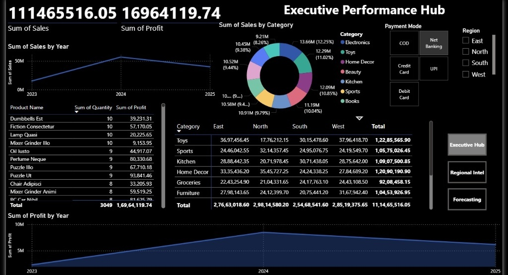
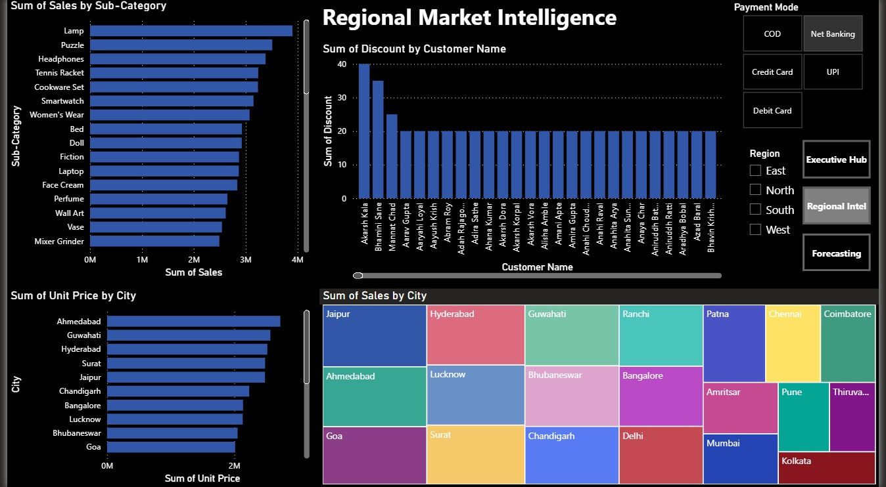
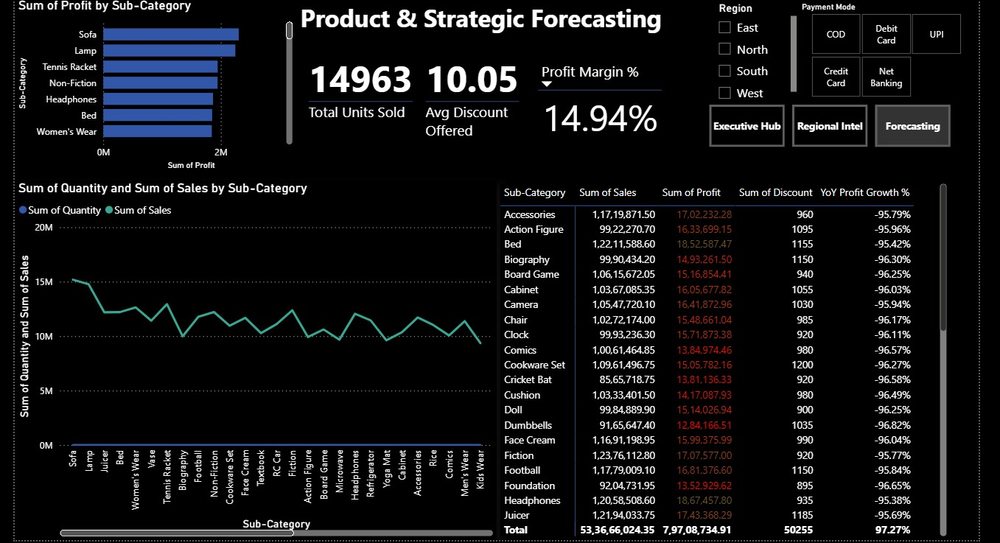
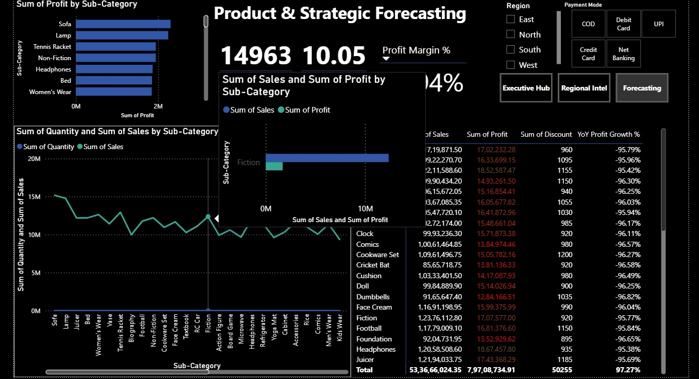
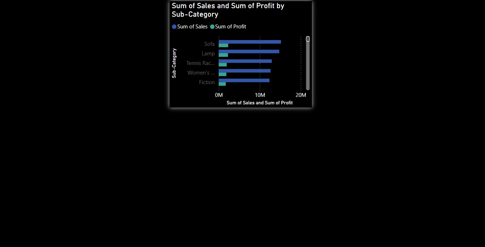

# 📊 Advanced Customer Segmentation & Executive Performance Hub

An enterprise-grade Business Intelligence (BI) and Data Analytics solution engineered to decode multi-region sales operations, profit dynamics, and consumer behavior granularities. This project demonstrates high-tier data transformation, robust star-schema modeling, and advanced analytical reporting designed for corporate strategic deployment.

---

## 💾 Dataset Architecture & Core Features
The project ingest an **Enterprise Global E-Commerce & Retail Sales Transactional Dataset** comprising thousands of raw operational ledgers. The data structure captures the complete lifecycle of end-to-end retail fulfillment divided into the following attributes:

* **Financial Transaction Matrix:** Tracks granular financial indicators: `Sales`, `Profit`, `Quantity`, `Unit Price`, and `Discount`.
* **Customer Demographics:** Profiles consumer footprints through relational data: `Customer Name`, `City`, and operational `Region` (East, West, North, South).
* **Product Line Classification:** Segments performance arrays across 2 critical structural tiers: `Category` (e.g., Electronics, Furniture, Home Decor) and `Sub-Category` (e.g., Sofa, Lamp, Smartwatch).
* **Operational Meta-Data:** Includes localized parameters like `Payment Mode` (UPI, COD, Net Banking, Credit/Debit Card) and temporal timelines (`Year 2023 - 2025`).

---
* **Source Dataset Registry:** The raw untransformed source file utilized for this data pipeline is preserved in the root repository folder as `Financial Sample.xlsx`.
---

## 🛠️ Data Engineering & Architecture Highlights
The pipeline transforms raw operational records into optimized transactional models. The back-end structure is built using a rigid **Star Schema** optimized for high-performance query execution and seamless cross-filtering.

* **ETL Pipeline:** Configured via Power Query for data cleansing, row normalization, and schema standardization.
* **Modeling Framework:** Implemented multi-table physical relationships to enforce strict referential integrity across operational segments.
* **Analytical Engine:** Leveraged complex DAX (Data Analysis Expressions) for time-intelligence operations, dynamic forecasting, and cross-category margin evaluation.

---

## 🎮 Strategic Executive Dashboards

### 1. Executive Performance Hub
Monitors macro-level strategic financial KPIs, including overall total profit, year-over-year revenue velocity, and regional performance matrices through custom dark-themed UI components.

### 2. Regional Market Intelligence
Provides granular geographic profiling of distribution networks, regional discounts, and city-wise pricing variations utilizing interactive tree-map visualizations.

### 3. Product & Strategic Forecasting
A deep-dive operational panel mapping units sold against avg discount metrics to isolate high-margin product layers and flag strategic overheads.

---

## ⚡ Granular Interactivity & Tooltip Integration

### 4. Advanced Operational Tooltip Grid
Showcases customized micro-visual tooltips embedded within the core layers to allow instant contextual analysis on hover without breaking dashboard fluidity.

### 5. Categorical Deep-Dive Snippet
Isolated slice demonstrating sub-category profiling, designed to handle thousands of unique transactional rows dynamically.

---

## 🚀 Deployment & Local Replication Guide
> ⚠️ **Enterprise Security Notice:** Due to tenant-level domain restrictions and data privacy policies enforced by the organization's host domain (`@gift.edu.in`), the live Power BI Service cloud gateway is restricted to internal network nodes.

**To execute and interact with the full dynamic pipeline locally:**
1. Clone this repository to your local architecture.
2. Ensure you have the latest version of **Power BI Desktop** installed.
3. Open the main source file: `Customer_Segmentation_Analysis.pbix`.
4. Use the slicers, regional parameter filters, and interactive timelines to view the real-time cross-filtering engine.
